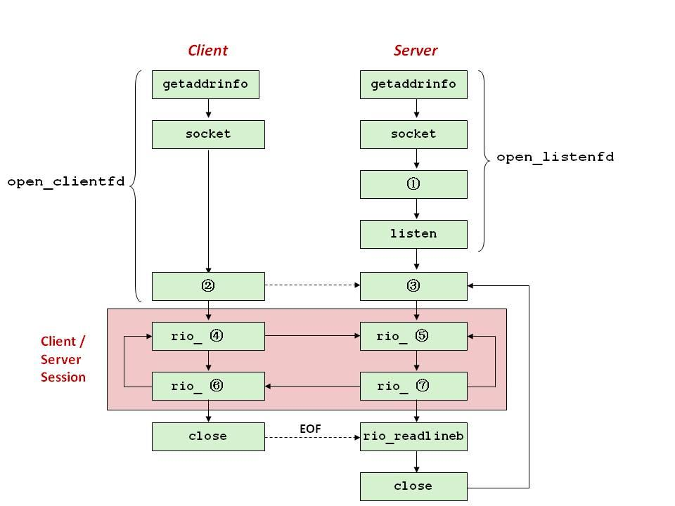

+++json
{
  "schemaVersion": "5",
  "id": "q-2b4c6c474fcda60d",
  "revision": 2,
  "paperId": "p-98acf19964247e22",
  "paperOrder": 25,
  "number": {
    "display": "第六题",
    "major": {
      "display": "第六题",
      "value": "6"
    },
    "minor": null,
    "parts": []
  },
  "classification": {
    "primaryModuleId": "network",
    "moduleIds": [
      "network"
    ],
    "tags": []
  },
  "publication": {
    "state": "published",
    "basis": "legacy-migration",
    "reviewer": null,
    "reviewedAt": null,
    "issues": []
  },
  "sources": [
    {
      "legacyId": "q-2b4c6c474fcda60d",
      "document": "原文/期末/2019期末-无答案.md",
      "lines": {
        "start": 532,
        "end": 581
      },
      "curated": "_curated/期末/2019期末-无答案/532.md",
      "aliases": [],
      "provenance": "rewritten",
      "editorNote": "client-server echo 框架与 open_listenfd 补全"
    }
  ],
  "type": "fill",
  "stem": {
    "format": "markdown",
    "blanks": [
      {
        "id": "diagram-1",
        "marker": "{{blank:diagram-1}}",
        "occurrence": 0,
        "width": "medium"
      },
      {
        "id": "diagram-2",
        "marker": "{{blank:diagram-2}}",
        "occurrence": 0,
        "width": "medium"
      },
      {
        "id": "diagram-3",
        "marker": "{{blank:diagram-3}}",
        "occurrence": 0,
        "width": "medium"
      },
      {
        "id": "diagram-4",
        "marker": "{{blank:diagram-4}}",
        "occurrence": 0,
        "width": "medium"
      },
      {
        "id": "diagram-5",
        "marker": "{{blank:diagram-5}}",
        "occurrence": 0,
        "width": "medium"
      },
      {
        "id": "diagram-6",
        "marker": "{{blank:diagram-6}}",
        "occurrence": 0,
        "width": "medium"
      },
      {
        "id": "diagram-7",
        "marker": "{{blank:diagram-7}}",
        "occurrence": 0,
        "width": "medium"
      },
      {
        "id": "bind-call",
        "marker": "{{blank:bind-call}}",
        "occurrence": 0,
        "width": "medium"
      },
      {
        "id": "freeaddrinfo-arg",
        "marker": "{{blank:freeaddrinfo-arg}}",
        "occurrence": 0,
        "width": "medium"
      },
      {
        "id": "listenfd-return",
        "marker": "{{blank:listenfd-return}}",
        "occurrence": 0,
        "width": "medium"
      }
    ]
  },
  "solution": {
    "state": "available",
    "grading": "blanks",
    "reference": {
      "format": "markdown"
    },
    "provenance": {
      "origin": "unknown",
      "crossChecked": null,
      "note": "Migrated from v3; answer text and any attribution are preserved. Legacy verified did not establish official provenance."
    },
    "blankAnswers": [
      {
        "blankId": "diagram-1",
        "method": "exact",
        "acceptedAnswers": [
          "bind"
        ],
        "normalize": {
          "caseSensitive": false,
          "trimWhitespace": true
        }
      },
      {
        "blankId": "diagram-2",
        "method": "exact",
        "acceptedAnswers": [
          "connect"
        ],
        "normalize": {
          "caseSensitive": false,
          "trimWhitespace": true
        }
      },
      {
        "blankId": "diagram-3",
        "method": "exact",
        "acceptedAnswers": [
          "accept"
        ],
        "normalize": {
          "caseSensitive": false,
          "trimWhitespace": true
        }
      },
      {
        "blankId": "diagram-4",
        "method": "exact",
        "acceptedAnswers": [
          "rio_writen"
        ],
        "normalize": {
          "caseSensitive": false,
          "trimWhitespace": true
        }
      },
      {
        "blankId": "diagram-5",
        "method": "exact",
        "acceptedAnswers": [
          "rio_readlineb"
        ],
        "normalize": {
          "caseSensitive": false,
          "trimWhitespace": true
        }
      },
      {
        "blankId": "diagram-6",
        "method": "exact",
        "acceptedAnswers": [
          "rio_readlineb"
        ],
        "normalize": {
          "caseSensitive": false,
          "trimWhitespace": true
        }
      },
      {
        "blankId": "diagram-7",
        "method": "exact",
        "acceptedAnswers": [
          "rio_writen"
        ],
        "normalize": {
          "caseSensitive": false,
          "trimWhitespace": true
        }
      },
      {
        "blankId": "bind-call",
        "method": "exact",
        "acceptedAnswers": [
          "bind"
        ],
        "normalize": {
          "caseSensitive": false,
          "trimWhitespace": true
        }
      },
      {
        "blankId": "freeaddrinfo-arg",
        "method": "exact",
        "acceptedAnswers": [
          "listp"
        ],
        "normalize": {
          "caseSensitive": false,
          "trimWhitespace": true
        }
      },
      {
        "blankId": "listenfd-return",
        "method": "exact",
        "acceptedAnswers": [
          "listenfd"
        ],
        "normalize": {
          "caseSensitive": false,
          "trimWhitespace": true
        }
      }
    ]
  }
}
+++
%%% stem
第六题（10分）
下图是一个基于`echo`服务器的client-server框架
（1）  请给图中的编号填写相应的函数名。



图中编号①—⑦依次为：{{blank:diagram-1}}、{{blank:diagram-2}}、{{blank:diagram-3}}、{{blank:diagram-4}}、{{blank:diagram-5}}、{{blank:diagram-6}}、{{blank:diagram-7}}。

（2）  请补全下面`server`端`open_listenfd`函数中缺失的操作（Line 21, Line
26和Line 34）

```
Line 1:  int open_listenfd(char *port)
Line 2:  {
Line 3:     struct addrinfo hints, *listp, *p;
Line 4:     int listenfd, optval=1;
Line 5:     /* Get a list of potential server addresses */
Line 6:     memset(&hints, 0, sizeof(struct addrinfo));
Line 7:     hints.ai_socktype = SOCK_STREAM;
Line 8:     hints.ai_flags = AI_PASSIVE | AI_ADDRCONFIG;
Line 9:     hints.ai_flags |= AI_NUMERICSERV;
Line 10:    Getaddrinfo(NULL, port, &hints, &listp);
Line 11:
Line 12:     for (p = listp; p; p = p->ai_next) {
Line 13:         /* Create a socket descriptor */
Line 14:        if ((listenfd = socket(p->ai_family, p->ai_socktype,
Line 15:                                    p->ai_protocol)) < 0)
Line 16:           continue;  /* Socket failed, try the next */
Line 17:         /* Eliminates "Address already in use" error from
bind */
Line 18:         Setsockopt(listenfd, SOL_SOCKET, SO_REUSEADDR,
Line 19:                    (const void *)&optval , sizeof(int));
Line 20:
Line 21:         if ({{blank:bind-call}}(listenfd, p->ai_addr, p->ai_addrlen) == 0)
Line 22:           break;  /* Success */
Line 23:         Close(listenfd);
Line 24:     }
Line 25:     /* Clean up */
Line 26:     Freeaddrinfo({{blank:freeaddrinfo-arg}});
Line 27:     if (!p) /* No address worked */
Line 28:         return -1;
Line 29:
Line 30:     if (listen(listenfd, LISTENQ) < 0) {
Line 31:         Close(listenfd);
Line 32:         return -1;
Line 33:     }
Line 34:     return {{blank:listenfd-return}};
Line 35:  }
```
%%% reference
答案：（1）① bind ② connect ③ accept ④ rio_writen ⑤ rio_readlineb ⑥ rio_readlineb ⑦ rio_writen。
（2）⑧ `bind` ⑨ `listp` ⑩ `listenfd`。
解析：客户端先后调 connect / rio_writen / rio_readlineb / close，服务器先后调 bind / listen / accept / rio_readlineb / rio_writen / rio_readlineb / close；`open_listenfd` 的第 21 行是 `bind(listenfd, p->ai_addr, p->ai_addrlen)`，第 26 行 Freeaddrinfo(listp)，第 34 行 return listenfd。
（来源：2019、2020期末-答案解析）
