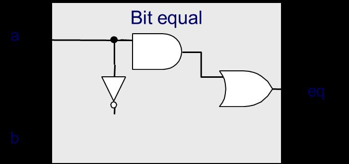
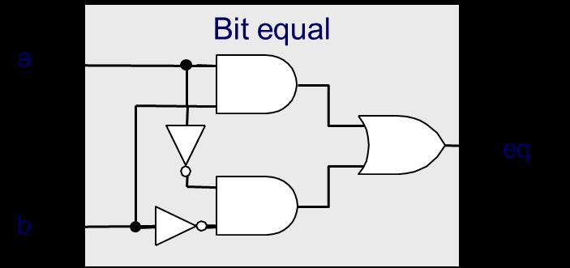
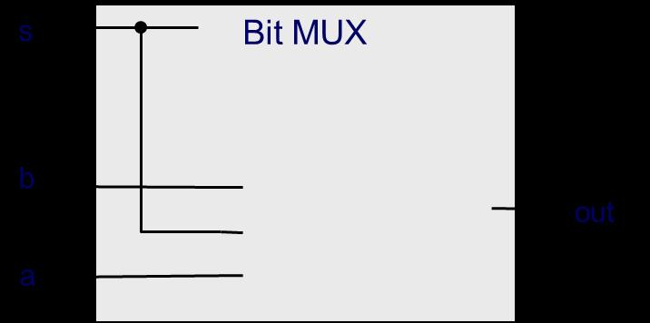
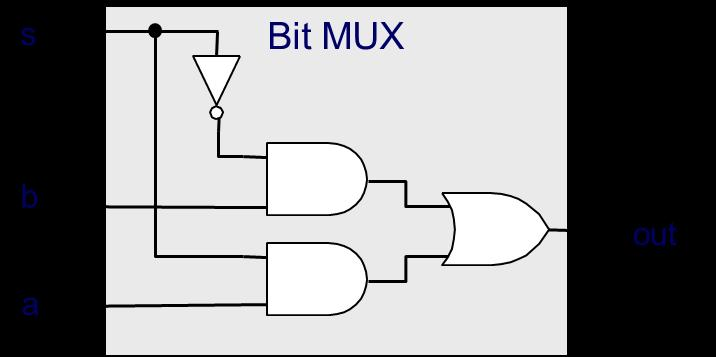
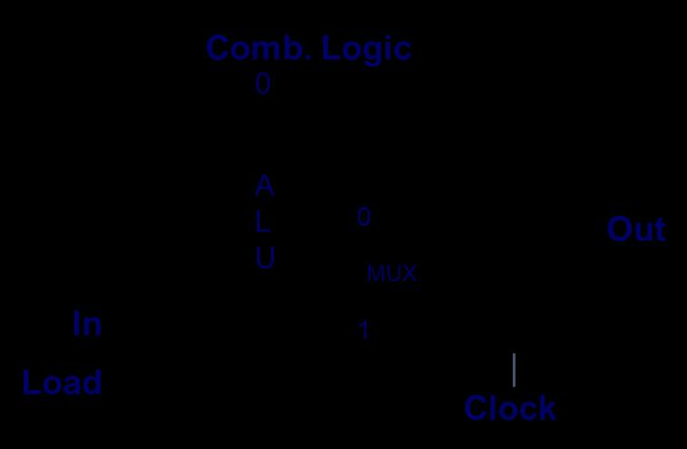
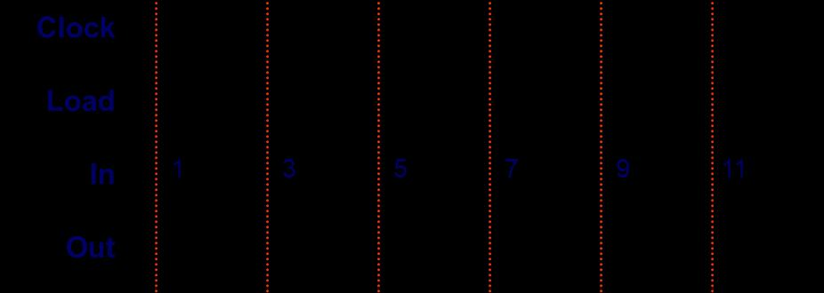
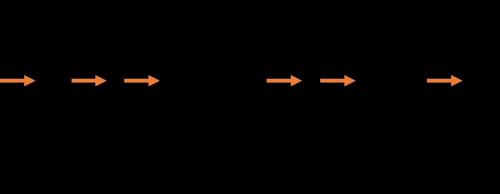
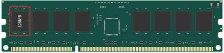

# 2025第2次阶段测验-带答案

> 来源：`往年题/阶段测验/2025第2次阶段测验-带答案.pdf`　共 11 页

<!-- ===== page 1 ===== -->

北京大学信息科学技术学院考试试卷
考试科目：计算机系统导论 姓名： 学号：
考试时间：2025年 11 月 17 日 大班号： 小班号：
题号 9 10 11 12 13 14/15 16/17 总分
分数
阅卷
人
北京大学考场纪律
1、考生进入考场后，按以照下监考以老下师为安答排题隔纸位，就座共，将学页生证放在桌面上。无学生证
者不能参加考试；迟到超过15分钟不得入场。在考试开始30分钟后方可交卷出场。
2、除必要的文具和主考教师允许的工具书、参考书、计算器以外，其它所有物品（包
括空白纸张、手机、或有存储、编程、查询功能的电子用品等）不得带入座位，已经带入
考场的必须放在监考人员指定的位置。
3、考试使用的试题、答卷、草稿纸由监考人员统一发放，考试结束时收回，一律不
准带出考场。若有试题印制问题请向监考教师提出，不得向其他考生询问。提前答完试卷，
应举手示意请监考人员收卷后方可离开；交卷后不得在考场内逗留或在附近高声交谈。未
交卷擅自离开考场，不得重新进入考场答卷。考试结束时间到，考生立即停止答卷，在座
位上等待监考人员收卷清点后，方可离场。
4、考生要严格遵守考场规则，在规定时间内独立完成答卷。不准交头接耳，不准偷
看、夹带、抄袭或者有意让他人抄袭答题内容，不准接传答案或者试卷等。凡有违纪作弊
者，一经发现，当场取消其考试资格，并根据《北京大学本科考试工作与学术规范条例》
及相关规定严肃处理。
5、考生须确认自己填写的个人信息真实、准确，并承担信息填写错误带来的一切责
任与后果。
学校倡议所有考生以北京大学学生的荣誉与诚信答卷，共同维护北京大学的学术声
誉。
以下为试题和答题纸，共 页。
1


<!-- ===== page 2 ===== -->

注意事项：
（1）本试卷基本按照大班课程讲授次序分组，不是按照题目难度排序。题量较大，注意合
理安排时间。
（2）除特别说明外，默认技术前提是本课程课件和对应教材内容，例如：x86-64体系结构、
Linux操作系统、C语言程序等；汇编程序是对应C程序主体功能实现，不做高级别优化，
不一定是完整代码。涉及Y86-64体系结构时，采用课程中讲授的SEQ和PIPE等处理器结
构。
（3）除特别说明外，汇编程序代码按每行计分，其它按每空计分。
（4）不定项选择题全部答对才得分。
（5）在试卷上指定位置答题，包括冒号后、等号后、箭头后、横线上、括号里等。
批卷说明：（1）题目指明“用十六进制表示”，回答里没写0x不扣分；（2）寄存器前面
没写%不扣分；（3）在含义明确的情况下，汇编代码中的q（例如addq）没写不扣分
第9讲（12分）得分：
1. （不定项选择，2分）以下描述，哪些属于ISA规定的内容：ABCFG
A. 有15个通用寄存器，每个寄存器64位
B. 有3个条件码，分别是ZF、SF、OF
C. 过程调用指令（call）会将下一条指令地址压入栈中
D. 过程调用的前2个参数放在寄存器rdi、rsi
E. 过程调用返回值放在寄存器rax
F. 内存是字节寻址的，字节序采用小端法
G. 访存指令支持寄存器加偏移的寻址模式
2. （2分）Y86-64中的这两条指令：
```
rmmovq rA,D(rB)
mrmovq D(rB),rA
```
第2条指令为什么不设计成mrmovq D(rA),rB？这样都是rA在前rB在后，看起来
更加规整。
答：硬件电路上都通过rB的通路计算出地址，电路更为简单
3. （各3分，共6分）根据HCL表达式补全电路图
(1)bool eq = (a&&b)||(!a&&!b)
2

<!-- ===== page 3 ===== -->

答案：
(2)bool out = (s&&a)||(!s&&b)
答案：
4. （2分）根据下面左边电路图，补全右边时序图里Out信号的值（In/Out均用10进
制表示）
答案：1 4 9 7 16 27
第10讲（16分）得分：
5. （8分）Y86-64的popq指令编码格式如下：
3









<!-- ===== page 4 ===== -->

根据popq指令的操作，补全下表（共需填8行9空）
答案：
6. （8分）以下是SEQ处理器中ALU的A口输入端信号（aluA）生成逻辑的分析，只列
出了部分指令。根据各指令功能，并参考下面已经给出的信息，补全空缺（表格中2
空，HCL代码中6空）。
4


<!-- ===== page 5 ===== -->

```
int aluA = [
icode in { IRRMOVQ, IOPQ } : valA;
icode in { IIRMOVQ, IRMMOVQ, IMRMOVQ } : valC;
icode in { ICALL, IPUSHQ } : -8;
icode in { IRET, IPOPQ } : 8;
# Other instructions don't need ALU
];
```
答案：
5


<!-- ===== page 6 ===== -->

第11讲（16分）得分：
7. （4分）如下图所示的三级流水线结构，单条指令的延迟（delay）是 340 ps，
流水线满负荷运转时，每 180 ps完成一条指令。如果能理想化地进一步细分流水
级（不跨现有流水级重排电路、也不过度细分），恰好划分成均衡流水线，那单条指令
的延迟（delay）是 420 ps，流水线满负荷运转时，每 60 ps完成一条指令。
8. （6分）阅读下面这段Y86-64汇编代码
```
1 irmovq $1,%rax
2 irmovq $2,%rax
3 irmovq $3,%rdx
4 addq %rax,%rdx
```
当这段代码在PIPE处理器上运行时，当addq指令在流水级D/Decode/译码（任一
都对）阶段时，会检测到数据冒险。此时运用了数据前递技术，其中在流水级 M 阶
段的指令前递数据 2 作为操作数%rax的值。
9. （4分）写出一段存在Load-use相关的Y86-64汇编代码（要求代码简洁明了），
并说明能否用数据前递技术解决，为什么？
答：代码示例如下（2分）：
```
mrmovq 0(%rdx),%rax
addq %rbx,%rax
```
注意：代码不用一模一样，关键点是前一条指令读内存到某个寄存器（这里是rax)，后一条指令要
读取这个寄存器
“Load-use”不能用数据前递技术解决，因为上面的add指令在译码阶段就要“use”，
这时前一条指令还在执行阶段，还有一个周期才能到访存阶段进行“load”。（2分）
注意：如果回答用数据前递技术可以部分解决，也算对。
10.（2分）写出一段存在Load-use相关和ret组合的Y86-64汇编代码（要求代码简
洁明了）。
答：代码示例如下（2分）：
```
mrmovq 0(%rdx),%rsp
ret
```
注意：代码不用一模一样，关键点是前一条指令读内存到rsp寄存器，后一条指令是ret
6



<!-- ===== page 7 ===== -->

第12讲（14分）得分：
11.（2分）对比同样容量的SRAM和DRAM，功耗更高是 SRAM ，价格更低是 DRAM 。
12.（判断对错，2分）ROM是只读存储器的简称，是非易失性存储器，掉电不会丢失数据，
只能读不能写。对还是错：（ 错 ）
13.（4分）下图是一根DDR3SDRAM内存条，数据位宽是64-bit，总容量为2GB，由8
颗内存芯片构成。如果一个计算机系统只有这根内存条作为全部内存，那往地址
0x01001000写一个64-bit数0x12345678，这个数会放在内存条上从左向右数第
几颗（或哪几颗）内存芯片中？并解释这样存放的原因。
答：这个64-bit数分散在全部8颗内存芯片，每个芯片存8-bit（2分）。因为每
颗芯片数据位宽有限（8-bit），这样存放读取速度更快（2分）。注意：关键点是“分散”，
如果写成分散到从左往右的1~4颗或者5~8颗，并说明每颗芯片位宽16-bit，也算对。
14.（不定项选择，2分）机械硬盘和固态硬盘（SSD）对比，在主流产品形态下，下列属
于后者特点的是：ABCD
A. 速度快
B. 抗震耐摔
C. 运行噪音小
D. 体积小
E. 同样容量的价格更低
F. 支持写入的寿命更长
15.（4分）下面这段代码哪些地方体现了局部性原理？分别体现了什么类型的局部性。
```
int sum_array_rows(int a[M][N])
{
int i, j, sum = 0;
for (i = 0; i < M; i++)
for (j = 0; j < N; j++)
sum += a[i][j];
return sum;
}
```
答：共四种情况：指令、数据；空间、时间局部性。各1分:1）顺序执行的指令序列，
体现空间局部性；2）循环内部指令会反复执行，体现时间局部性；3）sum等变量反复被
读写，体现时间局部性；4）数组a中的数据按地址依次被读取，体现空间局部性。
7



<!-- ===== page 8 ===== -->

第13讲（16分）得分：
16.（6分）高速缓存（Cache）的三种未命中（Miss）是什么，分别说明出现的场景。
答：三种名称各1分（中英文回答一种即可），把命中称为失效，也算对
（1）冷启不命中（义务不命中），Cold(compulsory) miss
（2）容量不命中，Capacity miss
（3）冲突不命中，Conflict miss
三种对应场景各1分（简要描述即可），详见第13讲课件第8页。
17.（8分）有一个计算机系统，存储地址空间为64字节；采用直接映射（Direct-mapped）
的数据高速缓存（cache），其容量为16字节；每个高速缓存块（cache block）
为 4 字节（B=4Byte/block）；采用写分配（write-allocate）、写返回
（write-back）策略。Cache的当前状态如下表。
```
v Tag Block
set0 1 11 Mem[48-51]
set1 1 00 Mem[4-7]
set2 1 10 Mem[40-43]
set3
```
经过如下地址访问序列后（十进制表示，每次访问1个字节）：18 40 50 16 43 48，
在上表中更新Cache的状态。这个序列过程中，该高速缓存发生 2 次Hit和 4 次Miss。
（注：表格每行2分，一行全对才得分；填空每空2分）
18.（2分）Intel Core i7 CPU的L2 Cache容量，最有可能是下面哪种：（ C ）
A.4kB B.32kB C.256kB D.8MB
第14/15讲（14分）得分：
19.（4分）编译优化时会有两种限制情况，分别解释说明原因。
答：
（1）为什么有“过程调用”限制：
过程调用可能存在“边带效应”的操作，例如改变某些全局变量或静态变量的值（1分）；
即使给定相同参数，过程调用的返回值可能会不同，如受全局变量影响等（1分）。
（2）为什么有“存储器别名”限制：
两个看起来不同的内存引用，可能指向相同的内存位置（1分）；一些编程语言（如C
语言）允许这样的操作存在或者不检查这样的问题（1分）。
20.（不定项选择，2分）下面这段代码中，属于链接器要解析的符号包括：ADEG
8

<!-- ===== page 9 ===== -->

```
A.include B.stdio.h C.int D.cnt
E.print_value F.x G.main H.val
----------------------------------------------
#include <stdio.h>
int cnt = 10;
extern void print_value(int x);
int main() {
int val = 5;
print_value(val + cnt);
return 0;
}
```
21.（8分）下面是一段C代码main.c和对应目标文件main.o反汇编得到的代码。
```
----------------------------------------------
int array[2] = {1, 2};
int main(int argc, char** argv){
int val = sum(array, 2);
return val;
}
----------------------------------------------
0000000000000000 <main>:
0: 55 push %rbp
1: 48 89 e5 mov %rsp,%rbp
4: 48 83 ec 20 sub $0x20,%rsp
8: 89 7d ec mov %edi,-0x14(%rbp)
b: 48 89 75 e0 mov %rsi,-0x20(%rbp)
f: be 02 00 00 00 mov $0x2,%esi
14: bf 00 00 00 00 mov $0x0,%edi
19: e8 00 00 00 00 callq 1e <main+0x1e>
1e: 89 45 fc mov %eax,-0x4(%rbp)
21: 8b 45 fc mov -0x4(%rbp),%eax
24: c9 leaveq
25: c3 retq
----------------------------------------------
```
（1）地址14对应的mov指令，为什么要把0放到edi寄存器中?按源代码看，应该
是要放什么数，这里为什么是0，后续还会有什么操作？
答：要放到edi中的数据是数组array的首地址（1分）；编译成目标文件时，array
9

<!-- ===== page 10 ===== -->

数组在内存中的位置还不确定，所以用0代替（1分）；后续由链接器（1分）进行重
定位（1分），填上正确的数值。注：描述不用一模一样，按上述标记分数的关键点给
分。
（2）地址19对应的callq指令，看起来会转到地址1e，即下一条指令，这不合常
理，为什么？
答：callq指令要跳转到sum函数的起始地址（1分）；编译成目标文件时，sum函
数在内存中的位置还不确定，所以用0代替（1分）；按照callq指令的编码规则，
指令中保存的是callq下一条指令和要跳转的目标地址的差值，因为现在用0填充，
所以反汇编显示成下一条指令的地址，即1e（2分）。注：描述不用一模一样，按上
述标记分数的关键点给分。
第16/17讲（12分）得分：
22.（3分）整数运算中有可能会出现“除0异常”，如果这是属于Faults类型的异常，
是否可以在异常处理程序中，将结果修改成某个特殊值，例如全为1的二进制数，然
后继续执行该程序（指整数运算那个程序）后续指令？
答：不可以（1分）。Faults类型的异常，从异常处理程序返回后，要重新执行这条
“除0”指令，导致再次发生异常。所以只能终止该进程。（2分）注：如果一开始的结论
就不对，后面如何解读都不得分。
23.（3分）阅读下面这段程序
```
#include <stdio.h>
#include <unistd.h>
int main() {
printf("A\n");
pid_t pid = fork();
if (pid == 0) {
printf("B\n");
} else {
printf("C\n");
fork();
}
printf("D\n");
return 0;
}
```
该程序正常运行后，问
（1）会输出几次 D：3 次
10

<!-- ===== page 11 ===== -->

（2）B和C哪个先输出：不确定
（3）ACDBDD这个输出序列是否可能：是（√）否（ ）
24.（6分）阅读下面这段程序
```
#include <stdio.h>
#include <unistd.h>
#include <sys/wait.h>
int x = 1;
int main() {
printf("start: x = %d\n", x);
pid_t pid1 = fork();
if (pid1 == 0) {
x += 1;
printf("x = %d\n", x);
sleep(1);
pid_t pid2 = fork();
if (pid2 == 0) {
x += 2;
printf("x = %d\n", x);
} else {
x += 3;
printf("x = %d\n", x);
wait(NULL);
}
} else {
x += 4;
printf("x = %d\n", x);
wait(NULL);
printf("x = %d\n", x);
}
return 0;
}
```
（1）（2分）这个程序正常运行，会产生几个进程？（ 3 ）
（2）（2分）总共会输出多少行？（ 6 ）
（3）（2分）最后一行输出是：D
A.x=2 B.x=3 C.x=4 D.x=5 E.x=6 F.不确定
11
